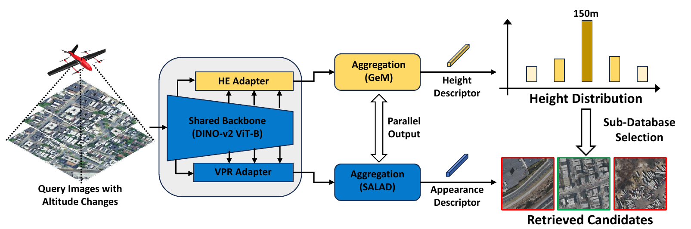
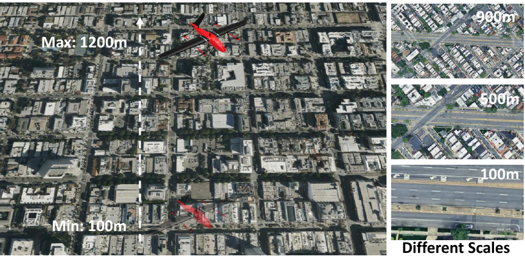
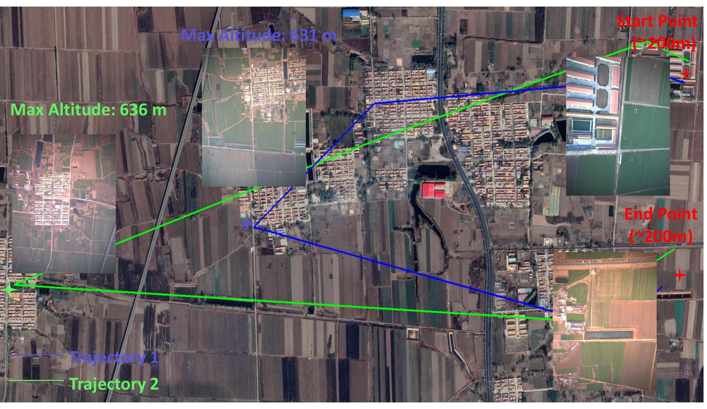

# HE-VPR: Height Estimation Enabled Aerial Visual Place Recognition against Altitude Variance

This is an incremental update of the original HE-VPR repository. `run.py` is the supported evaluation entry point; `test_HE.py` and `test_VPR.py` are retained as legacy research scripts.

HE-VPR addresses aerial visual place recognition when flight altitude changes the apparent scale of a scene. Instead of searching every map image at every height, it retrieves likely height levels from a compact height database, then searches the corresponding map sub-databases for the query location.



## Highlights

- **Height-aware retrieval:** a height-estimation (HE) branch selects candidate altitude levels before place retrieval.
- **Two bypass adapters:** HE and VPR use a DINOv2 ViT-B backbone with separate lightweight adaptation branches; the VPR branch uses SALAD aggregation.
- **Scale-robust descriptors:** the VPR adapter applies the center-weighted feature masking described in the manuscript.

The figure illustrates the proposed HE-VPR system. This release contains two separately loadable task checkpoints and full-database VPR evaluation. It does not yet include the online height-guided sub-database selection shown in the figure.

## Datasets

The manuscript evaluates HE-VPR on two multi-altitude datasets. **GEStudio** contains simulated urban drone views from Google Earth Studio; **MHFlight** contains real rural flights along two trajectories. The CLI names these datasets `gstudio` and `jimo`, respectively.

| Dataset | Queries | Height database | VPR database | Flight altitude |
| --- | ---: | ---: | ---: | --- |
| GEStudio | 1,200 | 102 | 29,768 | 100-1,200 m |
| MHFlight | 1,970 | 850 | 36,400 | 200-640 m |

| GEStudio | MHFlight |
| :---: | :---: |
|  |  |

### Results in the manuscript

Recall@1 at the **100 m positive threshold**, comparing the VPR adapter over the full database with height-guided sub-database selection:

| Method | GEStudio R@1 | MHFlight R@1 |
| --- | ---: | ---: |
| VPR adapter (full database) | 69.50% | 57.61% |
| HE-VPR (height Top-1) | 57.25% | 49.14% |
| HE-VPR (height Top-5) | 69.92% | 56.80% |
| HE-VPR (height Top-10) | 70.42% | 57.41% |

## Repository Structure

```text
HE-VPR/
|-- assets/                  # Figures from the manuscript
|-- dataloaders_for_HE/      # Original dataset classes
|-- models/                  # Original models plus missing Mona modules
|-- utils/                   # Original validation utilities
|-- weights/
|   |-- vpr.ckpt             # Add separately: VPR adapter
|   |-- he.ckpt              # Add separately: HE adapter
|-- tests/                  # Data-free retrieval checks
|-- THIRD_PARTY_LICENSES/   # Upstream license texts
|-- run.py                   # Feature extraction and retrieval evaluation
|-- test_HE.py, test_VPR.py  # Legacy test scripts
|-- requirements.txt
|-- RESULTS.md
```

The VPR checkpoint is the epoch-44 model used by the newer VPR evaluation; the HE checkpoint is its epoch-25 height model. Both include the complete backbone, so a separate DINOv2 foundation weight is unnecessary for inference. Raw datasets and training code are not included.

## Getting Started

Use Python 3.10 and install the dependencies. The local smoke test used PyTorch 2.5.1 and torchvision 0.20.1; choose matching CPU/CUDA wheels for your platform.

```bash
python -m pip install -r requirements.txt
```

Download the [model weights](https://cloud.tsinghua.edu.cn/d/a143e23c5ed34934a43a/), create a `weights/` directory, and place the checkpoints there as `vpr.ckpt` and `he.ckpt` before running extraction.

Place the datasets outside this folder. GEStudio expects `map_database/` and `query_images/` beneath its data root; MHFlight expects `map_database_2/` and `query_images/Traj1/` plus `query_images/Traj2/`. The image filenames must retain their `@`-separated location and height fields.

Extract VPR descriptors once, then evaluate full-database retrieval:

```bash
python run.py extract --dataset gstudio --data-root /path/to/GEStudio --features-dir /path/to/features --model vpr
python run.py evaluate --dataset gstudio --data-root /path/to/GEStudio --features-dir /path/to/features
```

Use `--dataset jimo` and the MHFlight data root for the other dataset. HE descriptors can also be extracted with `--model he`. This package does not generate height rankings or perform HE-guided sub-database retrieval.

## Release Notes

Third-party license texts are under `THIRD_PARTY_LICENSES/`.
